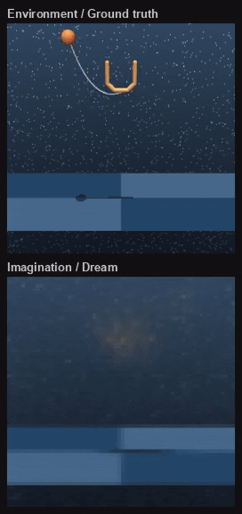
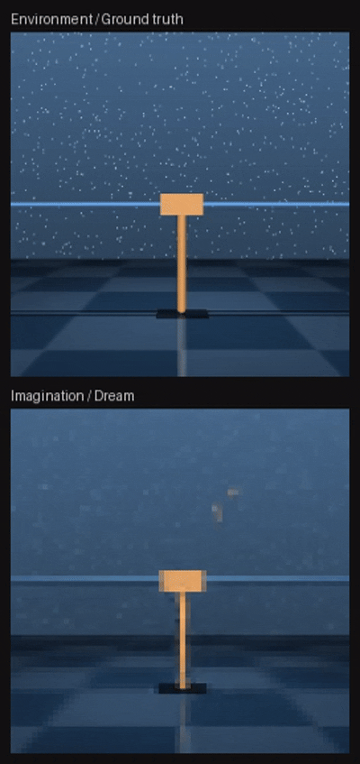

# World Model Dreamer Results

In addition to the Quadruped and Acrobot environments, Dreamer was also trained on Cup Catch, CartPole SwingUp and Reacher Easy.

  
  
   
  <em>Cup Catch and CartPole SwingUp latent imagination rollouts.</em>

