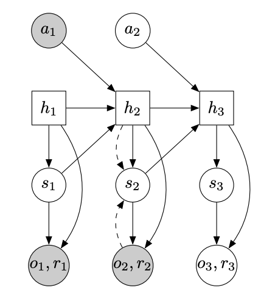

# Dreamer V1 

**Dreamer** is a *World Model* that learns latent space through which it backpropagates gradients in order to model the dynamics of the environment and behaviour of the agent, allowing it to solve long-horizon tasks from images purely in the latent imagination. 

## World Models and Latent Dynamics
*World models* allow the agent make predictions of the future in a latent space using a parametric model that represents its internal knowledge of the environment. The latent dynamics are learned from a dataset of past experiences collected by the agent while interacting with the environment and can predict future rewards given actions and past observations. These dynamics consist of a representation, transition, and reward model. The representation model encodes observations and actions into model states $s_t$ in the latent space, the transition model predicts future states using past actions and states without knowing the corresponding observations that would cause them, and the reward model predicts the reward for being in a given model state.

**Representation model:** $p_\theta(s_t \mid s_{t-1}, a_{t-1}, o_t)$

**Observation model:** $q_\theta(o_t \mid s_t)$

**Reward model:** $q_\theta(r_t \mid s_t)$

**Transition model:** $q_\theta(s_t \mid s_{t-1}, a_{t-1})$

It is important to note that imagined trajectories start at true model states $s_t$ drawn from the past experience of the agent, while the observation model is used only as a learning signal. Furthermore, the above components are jointly optimized to increase the variational lower bound (ELBO), which includes a reconstruction term for observations and rewards, as well as KL regularization:

$$\mathcal{J}_{\text{REC}} \doteq \mathrm{E}_p\left( \sum_t \left( \mathcal{J}_\mathrm{O}^t + \mathcal{J}_\mathrm{R}^t + \mathcal{J}_\mathrm{D}^t \right) \right) + \text{const}$$

$$\mathcal{J}_\mathrm{O}^t \doteq \ln q(o_t \mid s_t)$$

$$\mathcal{J}_\mathrm{R}^t \doteq \ln q(r_t \mid s_t)$$

$$\mathcal{J}_\mathrm{D}^t \doteq -\beta\, \mathrm{KL}\left( p(s_t \mid s_{t-1}, a_{t-1}, o_t) \,\big\|\, q(s_t \mid s_{t-1}, a_{t-1}) \right)$$

Lastly, during enviornment interaction, exploratory noise added to the actions to ensure stochasticity.

## Behaviour Learning via Latent Imagination

Predicted hypothetical latent trajectories in the imagination are used to learn the action and value models (**behaviour**) which function as an actor-critic algorithm. The value model aims to predict the expected imagined rewards while considering rewards beyond the imagination horizon, H, to avoid myopia as a result of a fixed, finite horizon. On the other hand, the action model propagates gradients through the dynamics in order to maximize the value estimates of the value model.

**Action model:** $a_\tau \sim q_\phi(a_\tau \mid s_\tau)$

**Value model:** $`v_\psi(s_\tau) \approx \mathbb{E}_{q(\cdot \mid s_\tau)}\left( \sum_{\tau=t}^{t+H} \gamma^{\tau - t} r_\tau \right)`$

To enable reparametrized sampling, the action model outputs a tanh-transformed Gaussian.

$$a_\tau = \tanh\left( \mu_\phi(s_\tau) + \sigma_\phi(s_\tau)\, \epsilon \right), \quad \epsilon \sim \mathrm{Normal}(0, \mathbb{I})$$

As when learning dynamics, imagined trajectories start at model states corresponding to real observations in past experiences, and predict forward using actions sampled from an action model up to the imagination horizon H. In order to estimate state values while considering rewards beyond the imagination horizon, Dreamer specifically uses $V_{\lambda}$, an exponentially weighted average of estimates that balances bias and variance. 

$$\mathrm{V}_\lambda(s_\tau) \doteq (1 - \lambda) \sum_{n=1}^{H-1} \lambda^{n-1} \mathrm{V}_\mathrm{N}^n(s_\tau) + \lambda^{H-1} \mathrm{V}_\mathrm{N}^H(s_\tau)$$

To update the action and value models, the state estimates $V_{\lambda}(s_{\tau})$ are computed for all states $s_{\tau}$ along the imagined trajectories, with the objective for the action model being to predict actions that result in trajectories that maximize value estimates while the value model aims to regress the target value estimates. The objective for the action and value models are the following, respectively:

$$\max_\phi \mathrm{E}_{q_\theta, q_\phi}\left( \sum_{\tau=t}^{t+H} \mathrm{V}_\lambda(s_\tau) \right)$$

$$\min_\psi \mathrm{E}_{q_\theta, q_\phi}\left( \sum_{\tau=t}^{t+H} \frac{1}{2} \left\| v_\psi(s_\tau) - \mathrm{V}_\lambda(s_\tau) \right\|^2 \right)$$

## Recurrent State-Space Machine (RSSM)
The transition model is a **Recurrent State-Space Machine** (RSSM), with transitions modelled by both stochastic and deterministic components to enable predicting multiple futures. Without the stochastic component, the model is purely deterministic and cannot capture multiple futures. Likewise without the deterministic component, the transitions are purely stochastic making it very difficult to remember information over multiple time steps and long sequences. 

   
  <em>Figure 1: The Recurrent State-Space Model (RSSM), the world model's latent core, introduced by PlaNet (Hafner et al., 2019). Solid lines denote the generative process; dashed lines denote the inference (posterior) path that corrects the prior using observations. Shaded nodes are observed during training.</em>

## Sources

Here is a list of sources used for this README.md and for learning about Dreamer, world models, and latent-imagination reinforcement learning:

---

### Papers

1. **Dream to Control: Learning Behaviors by Latent Imagination** (*The DreamerV1 paper this project reproduces*) [Link to paper](https://arxiv.org/abs/1912.01603) by Danijar Hafner, Timothy Lillicrap, Jimmy Ba, and Mohammad Norouzi.

2. **Learning Latent Dynamics for Planning from Pixels** (*PlaNet introduces the Recurrent State-Space Model (RSSM)*) [Link to paper](https://arxiv.org/abs/1811.04551) by Danijar Hafner, Timothy Lillicrap, Ian Fischer, Ruben Villegas, David Ha, Honglak Lee, and James Davidson.

3. **World Models** (*The foundational work on learning behaviors inside a learned model of the environment*) [Link to paper](https://arxiv.org/abs/1803.10122) by David Ha and Jürgen Schmidhuber.

---

### Reference Implementations

4. **dreamer-pytorch** (*PyTorch reproduction referenced for the RSSM structure and training loop*) [Link to repository](https://github.com/zhixuan-lin/dreamer-pytorch) by Zhixuan Lin.

5. **SimpleDreamer** (*A legibility-focused PyTorch reimplementation cross-referenced for component structure*) [Link to repository](https://github.com/kc-ml2/SimpleDreamer) by KC-ML2.
